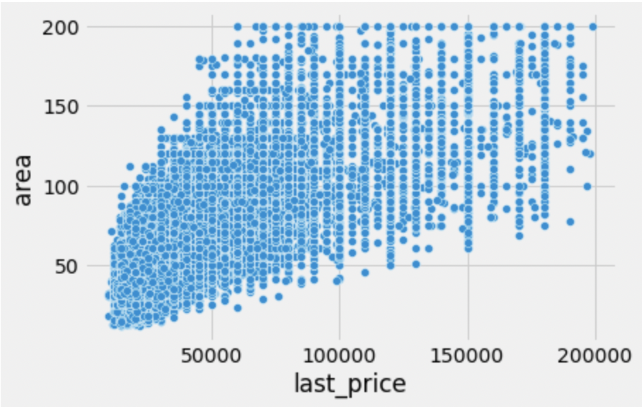
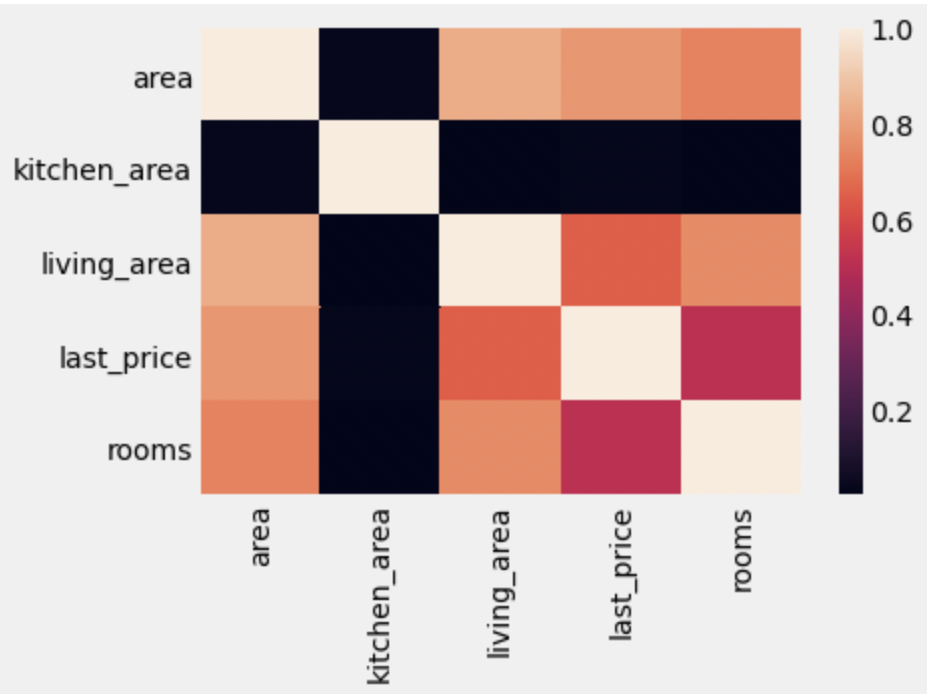

# Final Project: End-to-End Sample ML Project 
## Contents:
1. Source data information
2. The model
3. VM without using Docker
4. Info about Dockefile
5. How to build a Docker container
6. How to open a port in your VM
7. How to run app using docker and which port it uses


## 1.Source Data Information
We used data from [Yandex.Realty](https://realty.yandex.ru) about real estate prices in St. Petersburg for the period of Jan 2017 to Aug 2018.
We have treated data for outliers in the original dataset. The cleaned dataset is contained in the file **E2E cleaned_dataset.csv**. The code used is stored under **E2E final model.ipynb**. 



## 2.The model
We were required to have two models in this exercise, so we have used two models RandomForestRegressor and CatBoostRegressor to build two different models with the same variables. 
RandomForest used parameters such as:

- Room count – int
- Area – float
- Kitchen area – float
- Renovation – bool

CatBoost used:
- Room Count
- Area
- Ratio

The model used was RandomForestRegressor, because it showed less overfitting   

## 3. How to install instructions and run an app with virtual environment (without a docker)

Once you have created and connected to your VM, you can create you virtual environment **(without a docker)**:
1. `sudo apt install python3.8-venv`
2. `python3 -m venv env`
3. `source env/bin/activate`

You will also need to initialize a git repository in your virtual environment. To do this, you need to run:
1. `sudo apt install git` 
2. `git clone https://github.com/Anastasia2721/ml_proj_e2e.git`
3. `cd ml_proj_e2e`

Now you can pull the files from this repository. Afterwards you will need to install requirements from requirements.txt file by executing: `pip install -r requirements.txt`.

Examples of REST API call you can find in the `rest-api.http`.

## 4. Information about Dockerfile

You may want to have a look at **Dockerfile** in the repository. 
```linux
FROM python:3.8-slim-buster
WORKDIR /python-docker
COPY requirements.txt requirements.txt
RUN pip3 install -r requirements.txt
COPY . .
CMD [ "python3", "-m" , "flask", "run", "--host=0.0.0.0"]
```
We used `python` image to create our docker containers. Code copies all the content, installs all the required libraries stored in `requirements.txt`, and runs an application `app.py`.

## 5. How to build container using docker
Use the set of the following commands to make and launch the containers:
Build the container:

    docker build --tag st095434/ml_proj_e2e:v1.0 .
    
Launch the container:

    docker run --network host -d st095434/ml_proj_e2e:v1.0
Now the container is running!
You can use the same search query as before.

To exit the container you need to use *exit* command while inside of the container

To see the active containers use

    docker ps
To stop the container you need to use the callsign of this container and write in code:

    docker stop <container name>
 You can also push it to your container using the docker push command:
 

    docker push st095434/ml_proj_e2e:v1.0

## 6. How to open a port in your VM
If you want to open a port in your VM, you need to use the following code: `sudo ufw allow <number of the port>` you wish to open. The port number should be the same one you use in your version of the application.

If this port is already in use, you might want to use `htop` in order to stop the process that uses the port. You might need to install `htop` using `sudo apt install htop` before that.

## 7. How to run app using docker and which port it uses
Our docker is located [here](https://hub.docker.com/r/st095434/ml_proj_e2e) at [Docker Hub](https://hub.docker.com/).

If you want to use it for running an application, you will first need to install docker at your VM using these links:
1. Install docker engine: https://docs.docker.com/engine/install/ubuntu/
2. Post-installation steps for Linux: https://docs.docker.com/engine/install/linux-postinstall/

Now you can use `docker pull st095434/ml_proj_e2e:v1.0` to pull the container to your machine. 
Use the following command: `docker run -d -p 5000:5000 st095434/ml_proj_e2e:v1.0` to run the container with open port `5000`. 

Now you can send GET and POST request on your running application.

Example: `curl -X GET "http://localhost:5000/api/predict?open_plan=0&rooms=1&area=36&renovation=0&model=CB"`

If you want to change the port nuber, update `docker run` parameter.
To open the port for the VM see 5. How to open a port in your VM for that.